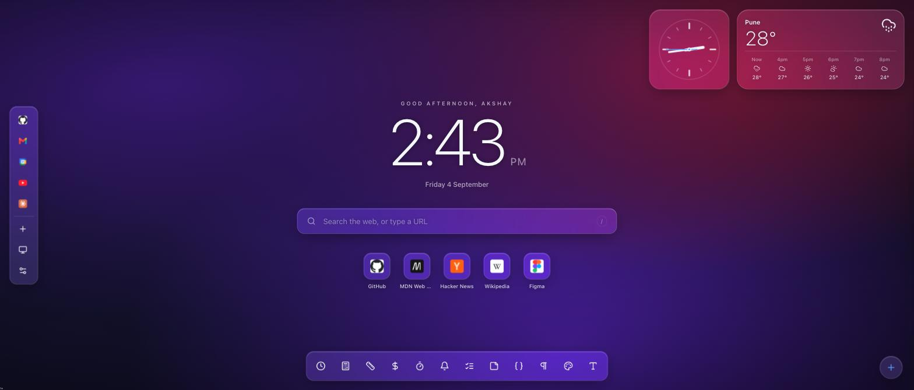
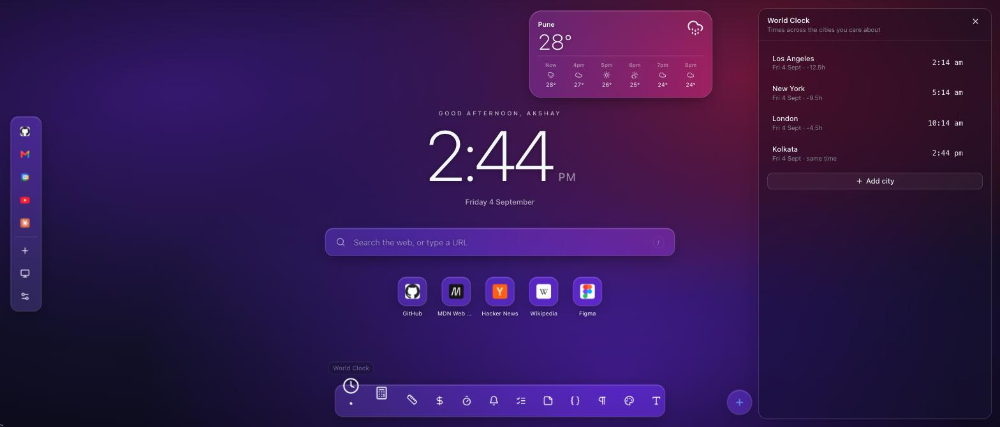
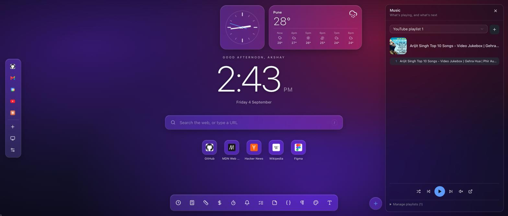
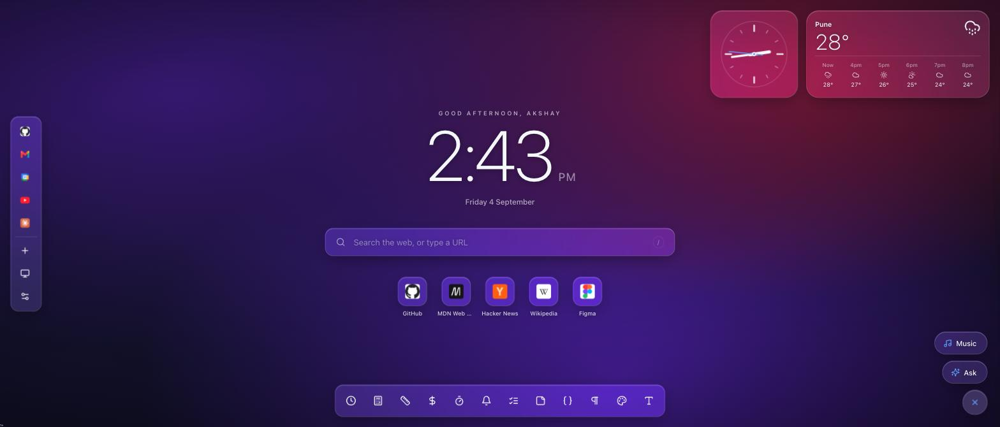
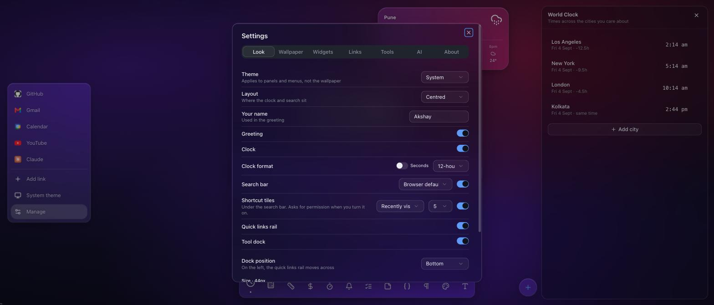

<div align="center">


# Alcove

**A quiet corner of your browser.**

Your own wallpapers, the links you actually use, a dock of small tools,
and a bring-your-own-key AI chat — on the new tab, in the side panel,
and on any page.

<p>
  
  
  
  
  
</p>



</div>

---

## A look around

|  |  |
|---|---|
|  |  |
| **Tools in a drawer.** The dock magnifies under the pointer like the macOS one; tools and chat share a single panel. | **Music without video.** A YouTube playlist, cover art and a queue — playback survives closing the drawer. |
|  |  |
| **One button, two panels.** A circular CTA fans out into Ask and Music instead of stacking pills in the corner. | **Everything is a setting.** Glass panels tint to the wallpaper's measured luminance, not the UI theme. |

---

## Quick start

```bash
pnpm install
pnpm dev          # launches Chrome with the extension loaded, hot reload on
pnpm build        # production build → .output/chrome-mv3
pnpm zip          # packaged for the Chrome Web Store
```

To load a production build by hand: `chrome://extensions` → enable Developer
mode → **Load unpacked** → pick `.output/chrome-mv3`.

**Firefox:** `pnpm dev:firefox` / `pnpm build:firefox`. Everything works except
the side panel and the new-tab override, neither of which Firefox supports the
same way — the floating chat and the tools are unaffected.

## Where it shows up

| Surface | What's there |
|---|---|
| **New tab** | clock, greeting, search, shortcut tiles, quick-link rail, tool dock, widgets, chat |
| **Side panel** | the same chat, docked — toolbar icon, or `⌘⇧Y` / `Ctrl+Shift+Y` |
| **Any page** | a launcher button that opens the chat in a floating panel |
| **Options page** | all settings, also reachable from the new tab |

---

## What's in it

**Search** hands your query to the browser's own search engine rather than
navigating to a hard-coded engine URL. That isn't a detail: a `window.location`
jump to `google.com/search` from a `chrome-extension://` page carries no
`Referer` at all and none of the client parameters a real omnibox search has,
and Google answers it with the "unusual traffic" captcha instead of results.

**Wallpapers.** Upload your own (drag and drop, several at once), pick a
built-in mesh gradient, or a solid colour. Uploads are downscaled to 2560px and
re-encoded as WebP on the way in, then stored as blobs in IndexedDB. Blur and
dim sliders keep text readable over a busy photo; shuffle rotates the library
on every new tab.

**Shortcut tiles.** A Chrome-style row of recently visited sites under the
search bar, one tile per site so revisiting the same place ten times doesn't
fill the row with it. Reading history is a heavyweight permission — the install
prompt reads *"Read your browsing history"* — so it isn't in `permissions` at
all: it's optional, and the row asks for it in place the first time you switch
it on. Say no and everything else still works. Settings → Look also offers
*most visited* (`topSites`), and 4–10 tiles.

**Widgets.** iOS-style cards in two fixed shapes — small (square) and wide.
Drag one to move it; it snaps to one of six anchor zones. Hovering reveals
resize and remove on the corner. *Clock* comes in analogue or digital in any of
your world-clock zones; *Weather* is Open-Meteo (free, keyless); *Music* shows
what's playing.

**Tools.** World Clock, Calculator, Units, Currency, Timer + stopwatch,
Reminders, To-Do List, Notepad, JSON, Lorem Ipsum, Colour, and a Text & Dev
toolbox (Base64, URL, SHA-256, case conversion, UUIDs). Toggle any of them in
Settings → Tools.

**Chat.** Anthropic, OpenAI, OpenRouter, or a local Ollama. Streaming, a stop
button, per-surface transcripts, and a model list fetched live from whichever
provider you picked.

**Reminders** fire a real system notification. Type them the way you'd say them
— `call mom in 5m`, `standup at 9am`, `gym tomorrow at 6am` — and the time is
parsed out of the text, with a preview of what will be scheduled before you
commit.

---

## How some of it works

The interesting decisions, with the reasoning kept.

<details>
<summary><b>The dock, and why it doesn't use React state</b></summary>

<br>

The dock sits along the bottom by default and behaves like the macOS one: icons
swell under the pointer with a gaussian falloff, neighbours slide out of the
way, and the name floats above. Settings → Look mirrors what macOS exposes —
position (bottom / left / right), icon size, and magnification on/off plus
amount.

It runs on refs and `requestAnimationFrame` rather than React state. A
`pointermove` fires far more often than 60Hz, and re-rendering ten icons on
each one drops frames on exactly the interaction that has to feel liquid.

Distances are measured against each icon's **base** centre, computed from its
index rather than read back from the DOM — measuring geometry while animating
it feeds the output into the input, and the icons judder.

Neighbour displacement is driven by `(1 - influence)`, so it is zero directly
under the pointer. Driving it by `influence` instead makes the icon you are
aiming at the one that moves furthest, so it slides out from under the cursor
and can never be clicked.

Put the dock on the left and the quick-links rail moves across, since they'd
otherwise occupy the same strip.

</details>

<details>
<summary><b>Glass that follows the wallpaper, not the theme</b></summary>

<br>

Mesh gradients (overlapping soft radials, not a linear ramp) under a vignette
and a 3.5% film-grain layer that kills gradient banding.

Panels are real glass — blur, saturation boost, a bright inset top edge, a drop
shadow — and the glass tint follows the **wallpaper's measured luminance**, not
the UI theme, so it lightens over a dark photo and darkens over a light one.

Drawers and dialogs use the same treatment at a heavier blur (44px). They host
dense UI, so legibility comes from flattening what's behind into a wash of
colour rather than from opacity — which is what lets them stay genuinely
transparent instead of reading as flat slabs.

Everything rises into place on load, staggered, and collapses to a plain fade
under `prefers-reduced-motion`. The theme button cycles **system → light →
dark**, rather than a two-state switch that would have to throw away "follow
the OS".

</details>

<details>
<summary><b>YouTube playback needs a one-off hosted page</b></summary>

<br>

Chrome sends no `Referer` header from extension pages. YouTube uses it to
identify the embedder and answers **error 153**
(`embedder.identity.missing.referrer`) without it. No setting fixes this —
`origin`, `widget_referrer`, `referrerpolicy` and `youtube-nocookie.com` were
all tried, and `declarativeNetRequest` cannot append `Referer`.

So `player/player.html` in this repo is hosted as an ordinary web page (Vercel
or GitHub Pages, both free) and the extension frames **that** instead. Being a
normal page, it can even load YouTube's official IFrame API. Set its URL in
`lib/music/config.ts` (`PLAYER_URL`) and rebuild. See `player/README.md`.

**No video is ever shown, but the player still has to exist.** Three measured
constraints shape how: Chrome refuses to start media in a frame that is
off-screen *or* merely occluded, and YouTube refuses to play at all below
200×200. So the relay frame is laid out at 400×225, CSS-scaled to six pixels in
a corner, and what you see is cover art.

It lives in `MusicProvider` above every surface, which is why closing the drawer
doesn't stop the music — the drawer and the widget are only views onto a player
neither owns. Because it lives on the new tab, playback stops when you navigate
away from that tab; that's inherent to the surface.

**Mixes and radio playlists can't be used.** Anything whose id starts `LR…`,
`RD…` or `UL…` is auto-generated by YouTube from what you're watching, and
YouTube blocks all of them from embedded players — the embed loads, fires
`onReady`, then answers `onError 150` and plays nothing. Those are rejected when
you add them, with the reason.

The message listener checks `event.source`, not just the origin: every YouTube
frame on the page posts to the same window, so a second embed anywhere would
otherwise drive the transport with the wrong track.

</details>

<details>
<summary><b>Reminders that don't depend on the OS letting them through</b></summary>

<br>

Each reminder is one `chrome.alarms` alarm — the only timer that survives the
MV3 service worker being torn down. A `setTimeout` in the background dies when
the worker idles out, and one in a page dies with the tab. Alarms are re-armed
from storage on startup and after an update, because Chrome drops them on
extension reload. Chrome won't fire an alarm sooner than ~30s out, so nearer
times are clamped rather than stored as requested.

A fired reminder **also** raises an in-page alert on any open new tab and puts a
count on the toolbar icon; dismissing either clears both. System notifications
are not a channel an extension controls — macOS can refuse to display one with
no error at all, Focus modes swallow them, and Chrome reports success either
way — so they're the nice-to-have, not the mechanism.

**If a reminder doesn't appear,** the tool tells you which half broke. One that
reached "Reminded at …" means the alarm fired and the notification was
suppressed, by the OS rather than the extension; the reason is printed under the
item. One still listed as *overdue* means the alarm itself never ran. There's a
**Test notification** button for an immediate check.

</details>

<details>
<summary><b>Smaller ones</b></summary>

<br>

**Analogue clock hands** are rotated with SVG transforms rather than CSS
transitions: a transition on a hand wrapping 354° → 0° animates the long way
round, once a minute. Zones are read through `Intl` rather than `Date` getters —
`getHours()` only ever answers for the machine's own zone, and a hand-rolled
offset breaks twice a year on DST.

**Volume** is a vertical slider that appears above its button on hover, rather
than its own row: it costs one slot in a row that already exists, and the
reclaimed height goes to the queue. Clicking the button mutes; moving the slider
unmutes, because a slider that does nothing on a muted player is how you end up
stuck with no sound and no way back.

**Lorem Ipsum** is seeded rather than calling `Math.random()` directly. The text
is derived in a `useMemo`, so an unseeded generator would reshuffle the passage
on every unrelated re-render while you were reading it.

**JSON, Text & Dev and Notepad** override the shadcn `Textarea`'s
`field-sizing-content` with `field-sizing-fixed`. Content sizing grows the box
to fit its value, which is right for the chat composer and catastrophic for a
few hundred kB of pasted JSON — the textarea becomes thousands of pixels tall
and pushes everything below it out of the panel instead of scrolling.

**Widgets snap to anchors, not x/y.** Absolute positions would need collision
handling against the rails, the dock and the action button, and would land
somewhere different on every window size. Each zone is a horizontal band, so a
second widget grows along the screen edge — the rails and the dock are
vertically centred, and a stacked column in any corner runs straight into them.

</details>

---

## Bring your own key

Settings → AI. Keys go in `chrome.storage.local` — **not** `sync`, because sync
storage isn't encrypted and a key silently replicating to every machine you're
signed into isn't a property anyone asked for. They're sent to your chosen
provider and nowhere else.

Requests go directly from an extension-origin page to the provider. For
Anthropic that needs the `anthropic-dangerous-direct-browser-access` header,
which is the documented opt-in for exactly this bring-your-own-key case.

### Ollama

A local Ollama server rejects requests from unknown origins by default:

```bash
OLLAMA_ORIGINS='chrome-extension://*' ollama serve
```

---

## Data, and where it goes

| What | Where | Synced? |
|---|---|---|
| Settings, quick links, world clocks | `storage.sync` | yes |
| Music playlists | `storage.sync` | yes |
| API keys | `storage.local` | **no** |
| Wallpapers | IndexedDB (`tabby-wallpapers`) | no |
| Notepad, chat transcripts, FX rates | `storage.local` | no |

There is no server, no account, no analytics and no telemetry. Outbound
requests go to the AI provider you configured, Open-Meteo for weather,
`open.er-api.com` for exchange rates (cached for a day), YouTube for public
track titles, and a favicon lookup per quick-link hostname.

Quick-link icons are fetched **once per hostname** and then cached as blobs in
IndexedDB, so a link never hits the network twice. Only the origin is sent —
never the path or query. Google's `s2/favicons` is asked first because it
resolves per-subdomain (Gmail gets the envelope, Calendar gets the tile;
DuckDuckGo returns one generic Google "G" for every `*.google.com`), with
DuckDuckGo as the fallback and Chrome's own on-disk cache after that.

Settings → Links turns the network lookup off entirely, falling back to Chrome's
local favicon cache — free and offline, but it only knows sites you've already
visited.

The full policy is in [`privacy/index.html`](privacy/index.html).

---

## Where things live

```
entrypoints/
  newtab/         the new tab page
  sidepanel/      docked chat (Chrome)
  chat/           chat.html — the document the injected iframe points at
  options/        settings on its own page
  content.ts      injects only the launcher button
  background.ts   side panel behaviour, keyboard command, alarms
lib/
  ai/             provider-agnostic chat layer
  music/          player state, playlist store, link parsing
  search.ts       hands queries to the browser's own search
  settings.ts     the settings schema + sync-storage hooks
  wallpapers.ts   IndexedDB blob store, downscaling, gradients
  tools.tsx       the tool registry
  calc.ts         expression parser (no eval — MV3's CSP forbids it)
components/
  ui/             shadcn primitives
  newtab/ tools/ chat/ settings/ widgets/ music/
player/
  player.html     the hosted YouTube relay (not bundled)
```

**Why the chat lives in an iframe.** A content script's `fetch` inherits the
*host page's* origin, so calling an API host from one is a CORS failure no
header can fix. `chat.html` runs on the extension origin, where the manifest's
`host_permissions` actually apply — so the chat streams directly instead of
relaying every token through a service worker that idles out mid-response. The
iframe also keeps Tailwind's reset from repainting whatever site you're on.

### Adding a provider

One file under `lib/ai/providers/` implementing the `Provider` interface, plus
one line in `lib/ai/providers/index.ts`. Nothing in the UI mentions a provider
by name. Anything OpenAI-shaped is a single call to
`createOpenAICompatible({...})` — that's all OpenRouter and Ollama are.

### Adding a tool

One component under `components/tools/`, one entry in `lib/tools.tsx`. It shows
up in the dock and in Settings → Tools automatically.

### Adding a widget

```
components/widgets/MyWidget.tsx   +   one entry in lib/widgets.tsx
```

---

## Notes

**On the name.** The product is **Alcove**. A handful of internal identifiers
still read `tabby` — the two IndexedDB database names and the timer's alarm
name. Those address data already on a user's disk, so renaming them would orphan
every uploaded wallpaper and any scheduled timer. They stay.

**Icons.** `node scripts/make-icons.mjs` regenerates `public/icon/*.png` — edit
the two colours at the top of the script.
